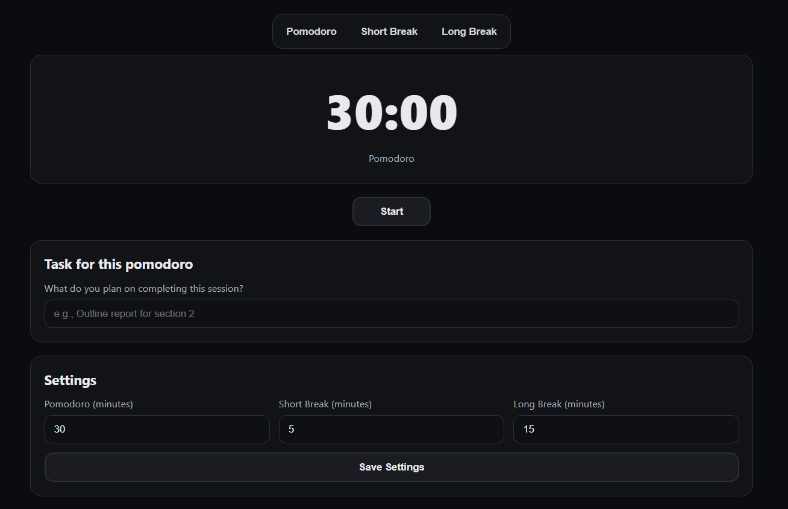

# Pomodoro Timer (HTML • CSS • JS)
A minimalist, responsive Pomodoro timer

## Live Demo
https://fiwiks.github.io/PomodoroTimer/

## Features
- Pomodoro / Short Break / Long Break modes
- Start / Pause / Reset
- Mobile-friendly layout
- Desktop notifications
- Local Storage persistence

## Screenshot

## Tech
Vanilla HTML, CSS, and JS-no frameworks.

## Getting Started
Open `index.html` locally or use the live demo. 
